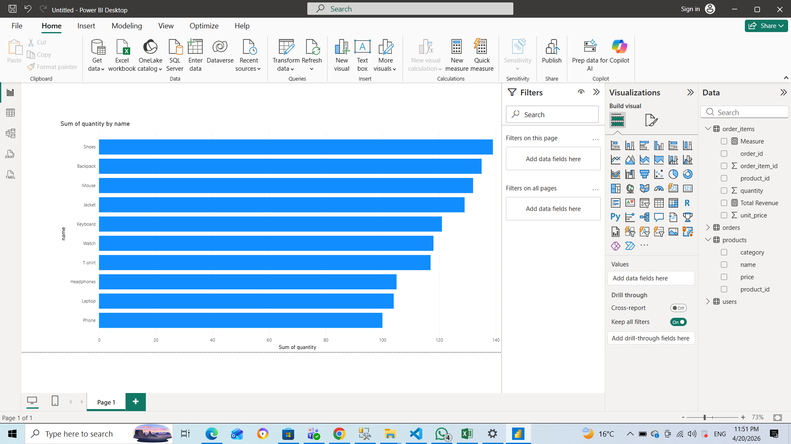

E-commerce Data Engineering Project

📌 Overview

This project demonstrates a complete data pipeline using Python, SQL Server, and Power BI.

🛠️ Technologies Used

- Python (ETL)
- SQL Server (Database)
- Power BI (Dashboard)

📊 Features

- Data generation using Python
- Data storage in SQL Server
- Data analysis using SQL queries
- Interactive dashboard in Power BI

📸 Dashboard Preview

🚀 How to Run

1. Run SQL scripts to create tables
2. Run Python notebook to generate and load data
3. Connect Power BI to visualize data

📈 Insights

- Total Revenue
- Top Products
- Sales Over Time
- Top Customers